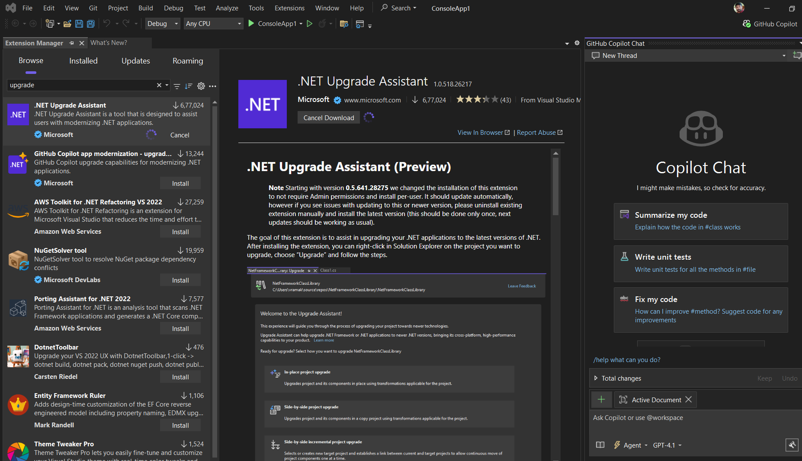
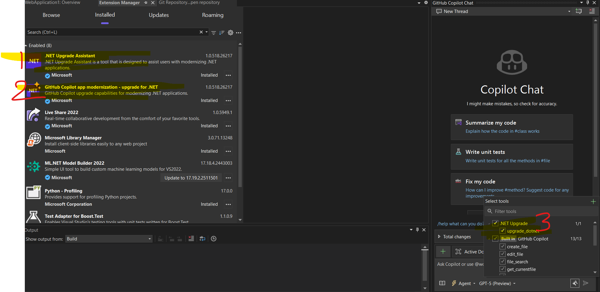
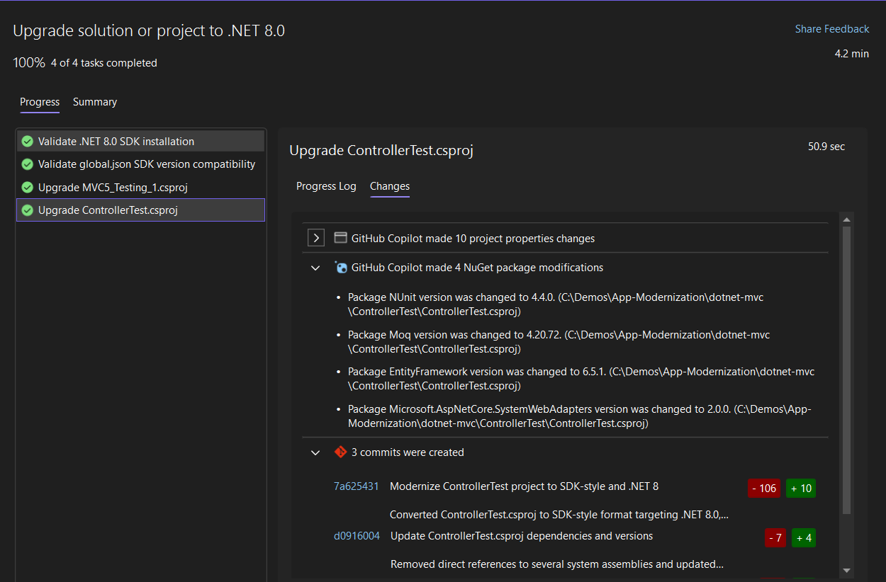
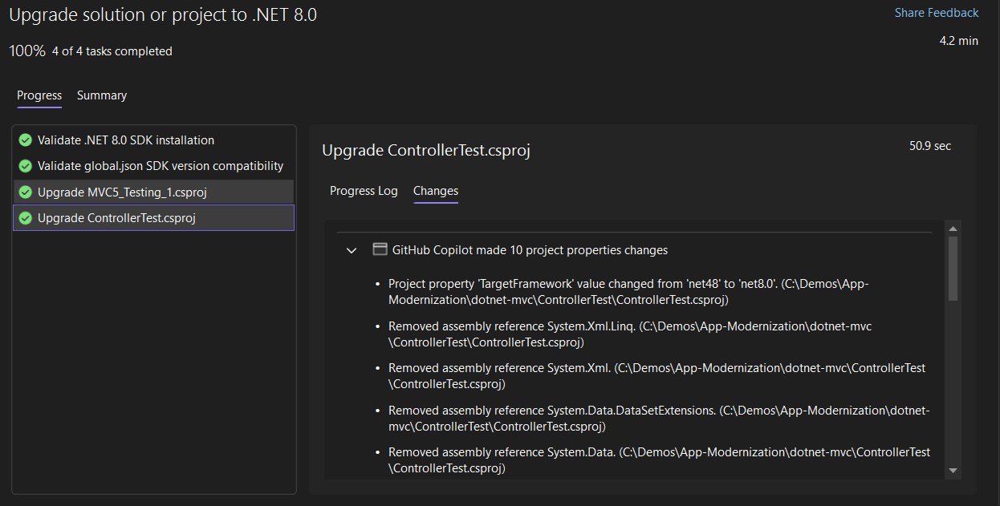

# .NET 4.8 to .NET 8 Modernization

This repository demonstrates upgrading a legacy ASP.NET MVC5 (.NET Framework 4.8) application to ASP.NET Core on .NET 8 using the **GitHub Copilot Upgrade Agent**.

## Goals
- Migrate from .NET Framework 4.8 to .NET 8 (LTS)
- Convert classic MVC5 project to SDK-style
- Replace Global.asax + RouteConfig with minimal hosting + endpoint routing
- Move from Unity / `Unity.Mvc5` to built-in dependency injection
- Update insecure / deprecated front-end libraries (jQuery, Bootstrap, jQuery.Validation, Unobtrusive Validation)
- Upgrade Entity Framework 6.x to latest EF6 (staying on EF6 for now) and prepare for future EF Core migration
- Introduce automated tests (NUnit + Moq) and modern test SDK

# Step 1: Set up your development environment
1. Open Visual studio, check for the latest version 17.14.13
2. Install the extensions as below, and you should see upgrade options in copilot chat --> Agent --> tools


3. Install .NET 8.0 and .NET 9.0 frameworks
4. Clone the repository `git clone https://github.com/your-org/dotnet-repo.git` or open .net solution in your Visual Studio IDE
5. Change the project directory and open **dotnet-mvc** in your Visual studio IDE 
6. Use main branch 
7. Open the solution and Build the project using Visual studio
8. Run the application and Tests if applicable

# Step 2: Upgrade Steps

1. Right Click on the solution - upgrade for .NET and click upgrade with GitHub copilot.

2. Follow the steps to complete the upgrade.



# Step 3: Post-Upgrade Steps

1. verify the upgrade plan generated a comprehensive list of changes.
1. verify the upgrade report.

## Tools & References
- Blog: GitHub Copilot Upgrade Agent announcement
  - https://devblogs.microsoft.com/dotnet/github-copilot-upgrade-dotnet/
- VS Marketplace (extension):
  - https://marketplace.visualstudio.com/items?itemName=ms-dotnettools.GitHubCopilotUpgradeAgent
- Documentation & modernization guidance:
  - https://learn.microsoft.com/en-us/dotnet/core/porting/github-copilot-app-modernization-overview


## Modernization Workflow (High-Level)
1. Analyze solution with Copilot Upgrade Agent (framework & package assessment)
2. Create and finalize upgrade plan (dotnet-upgrade-plan.md)
3. Validate .NET 8 SDK and global.json compatibility
4. Convert projects to SDK-style and change TFM to `net8.0`
5. Remove/replace legacy packages (System.Web-based, Unity.Mvc5, outdated frontend libraries)
6. Migrate application startup:
   - Global.asax -> Program.cs
   - RouteConfig -> `app.MapControllerRoute(...)`
7. Implement DI using `IDepartmentAccess` abstraction
8. Add / refactor tests with NUnit, Moq, Microsoft.NET.Test.Sdk, NUnit3TestAdapter
9. Clean up obsolete files and configuration
10. Generate upgrade report and create PR (`upgrade-to-NET8` branch)

## Key Changes
| Area | Legacy | Modern (.NET 8) |
|------|--------|-----------------|
| Project Format | csproj (non-SDK) | SDK-style `<Project Sdk="Microsoft.NET.Sdk.Web">` |
| Target Framework | .NET Framework 4.8 | `net8.0` |
| Startup | Global.asax + App_Start | Program.cs minimal hosting |
| Routing | RouteConfig + RouteTable | Endpoint routing (`app.MapControllerRoute`) |
| DI | Unity + Unity.Mvc5 | Built-in DI container |
| Packages | Legacy MVC / Razor / WebPages | Framework-provided; removed packages |
| Front-end | Bootstrap 3, jQuery 1.x, jQuery.Validation 1.11 | Bootstrap 5.3, jQuery 3.7, jQuery.Validation 1.21 |
| EF | EntityFramework 6.1.x | EntityFramework 6.5.1 (latest EF6) |
| Testing | Minimal / legacy | NUnit 4 + Moq + Test SDK |
| Config | web.config system.web | Programmatic + appsettings.json (future) |

## Testing
Added NUnit tests for `DepartmentController` covering:
- Index returns expected model (mocked data layer)
- Create GET returns new model
- Create POST success redirects
- Create POST exception -> Error view
- Create POST null -> Error view

To run tests:
```
dotnet test ControllerTest/ControllerTest.csproj
```

## Branching & PR
- Upgrade branch: `upgrade-to-NET8`
- After validation and test pass, push branch and open PR against `main`.

## Next Potential Steps
- Migrate from EF6 to EF Core (scaffold DbContext, replace EDMX)
- Introduce appsettings.json configuration & logging improvements
- Add integration tests with WebApplicationFactory
- Apply security headers & middleware (HSTS, CSP, etc.)
- Containerize (Dockerfile + CI pipeline)

## How Copilot Upgrade Agent Helped
- Generated structured upgrade plan & executed sequential steps
- Automated SDK-style conversion & TFM changes
- Suggested removal of unsupported / redundant packages
- Identified vulnerable frontend library versions
- Assisted with DI migration and test scaffolding

---
Feel free to fork and adapt this modernization flow for your own legacy MVC applications.
